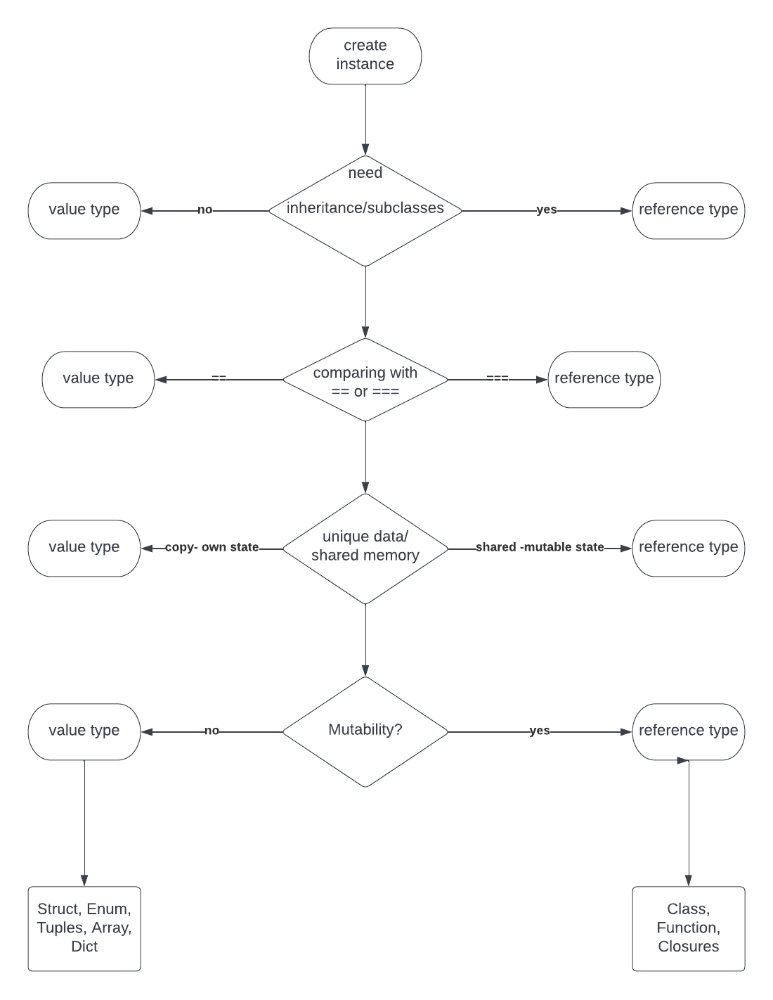

# ReferenceVsValueTypes Assignment

1. Write a small one page paper on:
   - What each is (reference and value type)
   - how are they different 
   - how they are utilized in iOS, Swift, and ObjC
   - pros and cons to either
    
    
   - A value type instance is an independent instance and holds its data in its own memory allocation. A value type is like an excel file, you copy an excel file / (email- download) and create your own data which is different from the original one. In Swift, Array, String, and Dictionary are all value types. They act as a unique instance of that data.
    
    - A reference type instances share a single copy of their data in which every new instance will point to the same data/address in memory. A reference type is lika a google sheet. A file is shared and if someone changes it.. other will see the changes in the file. 
    
    - Value types are defined as struct, enum, or tuple where as reference types are defined as class, function, or closure.
    
    - Value types can be used when comparing instance data with == . It checks every property of the two instances is the same. Use value type to have copies with an independent state and the data can be used across multiple threads. We get a unique copied instance and can be sure that no other part in the app is changing the data. more helpful in multi-threaded environments where a different thread can alter our data.
    
    - Reference types can be used when comparing instance identity with '===' makes sense (checking when two objects share the same memory address) and we also want to create shared, mutable state. Memory optimization is obtained with reference types.
    
    - Struct is lightweight and performance . It doesnot have inheritance. SwiftUI deals with view structs.If we don't need subclassing and inheritance, Struct is the best option.
    
    - Classes can be subclasses, parent class. UIButton is a subclass of UIView.There is lot of subclasses in UIKit(relies on inheritance and subclasses).
    
    - Mutability: If you create a struct constant, you can’t change the values of its properties, even though the values themselves might be variables.
        A class, on the other hand, lets you change them because you are referencing the memory address of the object. 
        Swift strings can be mutable (if declared with `var`), meaning you can call mutation methods on them, or immutable (if declared with `let`). In any case, they're value types, as they're always assigned/passed by value, making a copy of the string, not just the string reference.

```    
    struct Bike {
    
    let radius: Int
    var km: Float
  }

  let bike = Bike(radius: 22, km: 34.5)
  - we can't change the bike properties value if Let is used(although properties is var).. using var allows but not in case of class, we change the properties even if it is created with let in class)
  
```

 *** Value and reference type difference is defined in terms of what happens when you change data, there’s one case where value and reference types overlap: when instances have no writable data. In the absence of mutation, values and references act exactly the same way. ***
 
    
Write a flow chart on when it is better to use one vs the other.
    -Recommendation for this is to create a UML diagram flow chart
    -Look up Lucid Chart, it is a free diagram creating tool that is useful, but others can be used as well. (Lucid Chart just integrates seamlessly with common task tracking tools such as JIRA)
    -There will be times you will be expected to desing a system, so it is wise to familiarize yourself with UML diagrams early rather then on the job

 